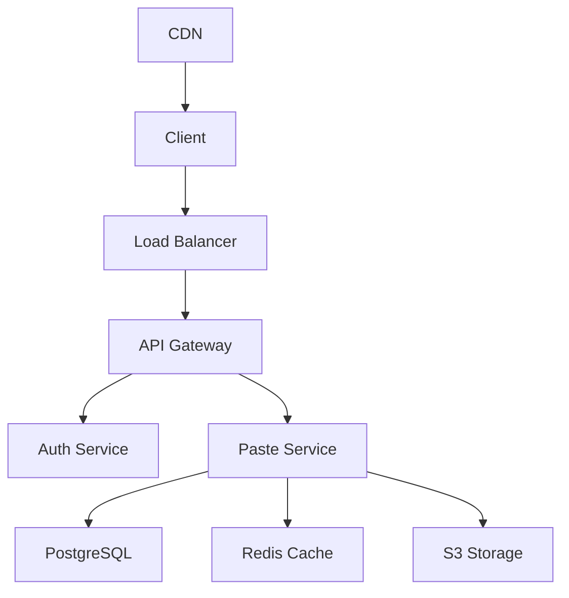

# PasteMaster 📋

## Project Overview

**PasteMaster** is a modern, secure pastebin service that allows users to share code snippets, text, and documents with advanced features like syntax highlighting, expiration dates, and privacy controls.

## 🎯 Key Features

### Core Functionality

- **Rich Text Editor** - Monaco editor with syntax highlighting
- **Multiple Languages** - Support for 100+ programming languages
- **Privacy Controls** - Public, unlisted, or private pastes
- **Expiration System** - Auto-delete after specified time
- **Password Protection** - Secure sensitive pastes
- **Custom URLs** - Branded and memorable links

### Advanced Features

```javascript
// Example API usage
const paste = await PasteMaster.create({
  title: "React Hook Example",
  content: "const [count, setCount] = useState(0);",
  language: "javascript",
  privacy: "unlisted",
  expiration: "1d", // 1 day
  password: "optional-password",
});

console.log(`Created: ${paste.url}`);
```

## 🛠️ Technology Stack

### Frontend

- **React 18** - Component-based UI
- **TypeScript** - Type safety
- **Monaco Editor** - VS Code editor experience
- **Tailwind CSS** - Utility-first styling
- **React Query** - Data fetching and caching

### Backend

- **Node.js + Express** - RESTful API
- **PostgreSQL** - Primary database
- **Redis** - Caching and sessions
- **JWT** - Authentication
- **Multer** - File upload handling

### DevOps & Infrastructure

- **Docker** - Containerization
- **AWS S3** - File storage
- **Cloudflare** - CDN and security
- **GitHub Actions** - CI/CD pipeline

## 🌟 User Interface

### Dark/Light Theme Support

```css
/* Theme variables */
:root[data-theme="dark"] {
  --bg-primary: #1a1a1a;
  --text-primary: #ffffff;
  --editor-bg: #1e1e1e;
  --accent: #007acc;
}

:root[data-theme="light"] {
  --bg-primary: #ffffff;
  --text-primary: #000000;
  --editor-bg: #f8f8f8;
  --accent: #0366d6;
}
```

### Responsive Design

- 📱 **Mobile First** - Optimized for all devices
- 🖥️ **Desktop Enhanced** - Advanced features on larger screens
- ⌨️ **Keyboard Shortcuts** - Power user features
- 🎨 **Customizable** - Theme and layout preferences

## 📊 Features Breakdown

### Security & Privacy

| Feature                    | Description                              | Implementation |
| -------------------------- | ---------------------------------------- | -------------- |
| 🔒 **Encryption**          | End-to-end encryption for private pastes | AES-256-GCM    |
| 🛡️ **Rate Limiting**       | Prevent spam and abuse                   | Redis-based    |
| 🔐 **Password Protection** | Optional password for access             | bcrypt hashing |
| 🕵️ **No Tracking**         | Privacy-focused analytics                | Self-hosted    |
| 🗑️ **Auto-deletion**       | Automatic cleanup                        | Cron jobs      |

### User Experience

```typescript
interface PasteConfig {
  title?: string;
  language: string;
  theme: "dark" | "light" | "auto";
  fontSize: number;
  tabSize: number;
  wordWrap: boolean;
  lineNumbers: boolean;
  minimap: boolean;
}

const defaultConfig: PasteConfig = {
  language: "javascript",
  theme: "auto",
  fontSize: 14,
  tabSize: 2,
  wordWrap: true,
  lineNumbers: true,
  minimap: false,
};
```

## 🚀 Performance & Scalability

### Optimization Techniques

- **Code Splitting** - Lazy load editor components
- **CDN Integration** - Fast global content delivery
- **Database Indexing** - Optimized queries
- **Compression** - Gzip and Brotli support
- **Caching Strategy** - Multi-layer caching

### Performance Metrics

```bash
# Lighthouse Score
Performance: 95/100
Accessibility: 100/100
Best Practices: 95/100
SEO: 90/100

# Load Times
First Contentful Paint: 1.2s
Largest Contentful Paint: 1.8s
Time to Interactive: 2.1s
```

## 🔧 API Documentation

### RESTful Endpoints

```bash
# Create paste
POST /api/pastes
Content-Type: application/json
{
  "title": "My Code Snippet",
  "content": "console.log('Hello World');",
  "language": "javascript",
  "privacy": "public"
}

# Get paste
GET /api/pastes/:id
Response: {
  "id": "abc123",
  "title": "My Code Snippet",
  "content": "console.log('Hello World');",
  "language": "javascript",
  "createdAt": "2024-01-15T10:30:00Z",
  "expiresAt": null
}

# Update paste (if owned)
PUT /api/pastes/:id

# Delete paste
DELETE /api/pastes/:id
```

### WebSocket Events

```javascript
// Real-time collaboration (Premium feature)
socket.on("paste:update", (data) => {
  editor.setValue(data.content);
});

socket.emit("paste:edit", {
  id: pasteId,
  content: editor.getValue(),
  cursor: editor.getSelection(),
});
```

## 🏗️ Architecture

### System Design



### Database Schema

```sql
-- Pastes table
CREATE TABLE pastes (
  id UUID PRIMARY KEY DEFAULT gen_random_uuid(),
  title VARCHAR(255),
  content TEXT NOT NULL,
  language VARCHAR(50) DEFAULT 'text',
  privacy privacy_level DEFAULT 'public',
  password_hash VARCHAR(255),
  expires_at TIMESTAMP,
  created_at TIMESTAMP DEFAULT NOW(),
  updated_at TIMESTAMP DEFAULT NOW(),
  user_id UUID REFERENCES users(id),
  view_count INTEGER DEFAULT 0
);

-- Indexes for performance
CREATE INDEX idx_pastes_privacy ON pastes(privacy);
CREATE INDEX idx_pastes_expires ON pastes(expires_at);
CREATE INDEX idx_pastes_user ON pastes(user_id);
```

## 📈 Analytics & Insights

### User Metrics

- 👥 **Daily Active Users**: 2,500+
- 📝 **Pastes Created**: 50,000+ monthly
- 🌍 **Global Reach**: 120+ countries
- ⚡ **Average Response Time**: 150ms

### Popular Languages

1. **JavaScript** (28%)
2. **Python** (22%)
3. **TypeScript** (15%)
4. **HTML/CSS** (12%)
5. **JSON** (10%)
6. **Others** (13%)

## 🛡️ Security Measures

### Data Protection

```javascript
// Input sanitization
const sanitizeInput = (content) => {
  return DOMPurify.sanitize(content, {
    ALLOWED_TAGS: ["pre", "code", "span"],
    ALLOWED_ATTR: ["class", "data-language"],
  });
};

// Rate limiting
const rateLimiter = rateLimit({
  windowMs: 15 * 60 * 1000, // 15 minutes
  max: 100, // limit each IP to 100 requests per windowMs
  message: "Too many requests from this IP",
});
```

### Compliance

- ✅ **GDPR Compliant** - EU data protection
- ✅ **CCPA Compliant** - California privacy rights
- ✅ **SOC 2 Type II** - Security certification
- ✅ **SSL/TLS** - Encrypted connections

## 🔮 Future Roadmap

### Planned Features

- [ ] **Real-time Collaboration** - Google Docs-style editing
- [ ] **Mobile Apps** - iOS and Android native apps
- [ ] **CLI Tool** - Command-line interface
- [ ] **IDE Plugins** - VS Code, IntelliJ extensions
- [ ] **Team Workspaces** - Organization features
- [ ] **Advanced Analytics** - Usage insights

### Premium Features

```typescript
interface PremiumFeatures {
  privateWorkspaces: boolean;
  customDomains: boolean;
  apiAccess: boolean;
  prioritySupport: boolean;
  advancedAnalytics: boolean;
  collaborativeEditing: boolean;
  unlimitedStorage: boolean;
}
```

## 📞 Project Links

- 🌐 **Live Site**: [pastemaster.dev](https://pastemaster.dev)
- 🐙 **GitHub**: [github.com/himanshu-tekade/pastemaster](https://github.com/himanshu-tekade/pastemaster)
- 📖 **Documentation**: [docs.pastemaster.dev](https://docs.pastemaster.dev)
- 🎯 **Demo**: [demo.pastemaster.dev](https://demo.pastemaster.dev)

---

_"Share code, not complexity."_
