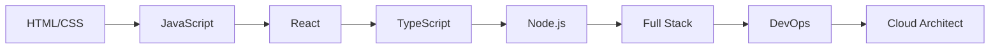

# Technical Skills

## 🎯 Core Competencies

### Frontend Development

- **React.js** ⭐⭐⭐⭐⭐
  - Hooks, Context API, Redux Toolkit
  - Server-side rendering with Next.js
  - Component libraries (Material-UI, Chakra UI)
- **TypeScript** ⭐⭐⭐⭐⭐

  - Type-safe application development
  - Advanced type definitions
  - Generic programming

- **JavaScript (ES6+)** ⭐⭐⭐⭐⭐
  - Async/await, Promises
  - Functional programming
  - Modern JavaScript features

### Backend Development

- **Node.js** ⭐⭐⭐⭐⭐

  - Express.js framework
  - RESTful API development
  - Microservices architecture

- **Python** ⭐⭐⭐⭐

  - Django & Flask frameworks
  - Data analysis with Pandas
  - API development

- **Database Management** ⭐⭐⭐⭐
  - PostgreSQL, MongoDB, MySQL
  - Query optimization
  - Database design patterns

## 🛠️ Development Tools

### Version Control

- **Git** ⭐⭐⭐⭐⭐
- **GitHub/GitLab** ⭐⭐⭐⭐⭐

### DevOps & Cloud

- **Docker** ⭐⭐⭐⭐
- **AWS Services** ⭐⭐⭐⭐
  - EC2, S3, Lambda, RDS
- **CI/CD Pipelines** ⭐⭐⭐⭐

### Testing

- **Jest** ⭐⭐⭐⭐
- **React Testing Library** ⭐⭐⭐⭐
- **Cypress** ⭐⭐⭐

## 💡 Specialized Skills

### 🎨 UI/UX Development

```css
/* Responsive Design */
.responsive-container {
  display: grid;
  grid-template-columns: repeat(auto-fit, minmax(300px, 1fr));
  gap: 1rem;
}

@media (max-width: 768px) {
  .responsive-container {
    grid-template-columns: 1fr;
  }
}
```

### 🔐 Security & Authentication

- JWT token management
- OAuth 2.0 implementation
- Secure API development
- Data encryption and hashing

### 📊 Performance Optimization

- Bundle size optimization
- Lazy loading implementation
- Image optimization
- Database query optimization

## 🚀 Recent Learning Focus

### 2024 Goals

- [ ] **Machine Learning** with TensorFlow
- [ ] **Rust** programming language
- [ ] **Kubernetes** container orchestration
- [ ] **GraphQL** API development
- [x] **Next.js 14** App Router
- [x] **React Server Components**

### Certifications

- ✅ **AWS Certified Developer Associate**
- ✅ **Google Cloud Professional Cloud Developer**
- ✅ **MongoDB Certified Developer**

---

## 📈 Skill Progression



---

_"The expert in anything was once a beginner who refused to give up."_
